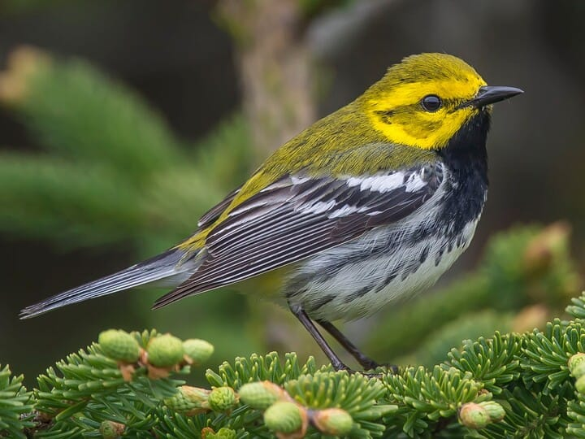

--- 
runtime: shiny

---

<left>

# Species Information: 

### Black-throated Green Warbler (*Setophaga virens*) 

  

:::: {style = "display: flex; gap: 10px;"} 

::: {style="flex: 47.5%;"}

{width=100%}

::: 

::: {style="flex: 5%;"} 

::: 

::: {style="flex: 47.5%;"}

## **CONSERVATION STATUS**

* <abbr title="Committee on the Status of Endangered Wildlife in Caada">COSEWIC</abbr> Status: None

* <abbr title="Alberta's Endangered Species Conservation Committee">ESCC</abbr> Status in  Alberta: Special Concern 

* <abbr title="Government of Alberta's general status of wildlife species">General</abbr> Status in  Alberta: Sensitive 

* <abbr title="Alberta Conservation Information Management System">ACIMS</abbr> Status in  Alberta: [<u>S3S4B</u>](https://www.alberta.ca/acims-conservation-status-ranks#jumplinks-1) 

* [<u>Link to **ABMI Status** Page</u>](https://abmi.ca/species/black+throated-green-warbler)

::: 

:::: 

 

## Overview

The black-throated green warbler (BTNW) is a migratory forest songbird species that is generally uncommon in the OSR. This species is most strongly associated with mature mixedwood and white spruce stands in the boreal forest and foothills regions of Alberta. Because of their dependence on mature, closed canopy forests and negative response to fragmentation, BTNW populations are sensitive to forest harvest, oil sands disturbances, and other forms of industrial development. Due to perceived population declines and expected future habitat loss, BTNW are considered a species of special concern in Alberta. 

  

